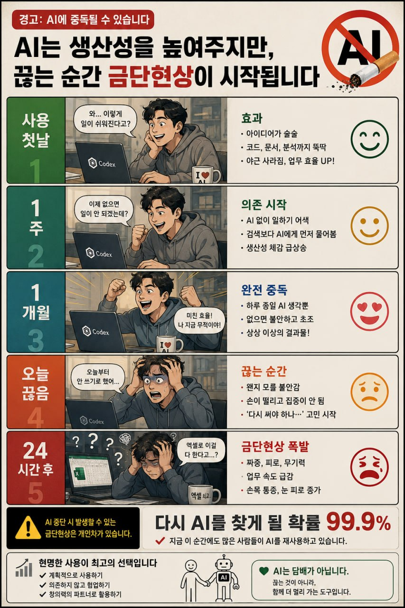

# 토큰을 아끼는 AI 에이전트 운영 전략

_삼성디스플레이 품질팀 AI 세미나 3차 보강자료 · 2026-07-07 초안_

> **인트로 카툰 — “AI는 생산성을 높여주지만, 끊는 순간 금단현상이 시작됩니다”**  
> 오늘 회사에서 Codex가 회사 전체 토큰 부족으로 전면 금지되었을 때 많은 사람이 느꼈을 감각을 매우 직관적으로 보여준다.  
> 이 세미나의 질문은 “AI를 덜 쓸까?”가 아니라, **“AI를 끊기지 않게, 더 싸고 더 안정적으로 굴리려면 어떻게 설계해야 하나?”** 이다.

## 왜 이 자료가 필요한가

오늘 회사에서 **Codex 사용이 “회사 전체 토큰 부족” 때문에 전면 금지**되는 일이 있었다.  
이 사건은 단순한 불편이 아니라, 앞으로 회사가 AI를 업무 인프라로 쓸 때 반드시 부딪히게 될 문제를 보여준다.

핵심은 세 가지다.

1. **토큰은 공짜가 아니다**
2. **에이전트는 편하지만, 방치하면 토큰을 태운다**
3. **토큰 절약은 비용 문제가 아니라 가용성·생산성·통제권 문제다**

이 자료의 목적은 “어떻게 덜 쓰느냐”가 아니라,  
**같은 성과를 더 적은 토큰으로 내는 조직 운영법**을 정리하는 것이다.

---

## 1. 오늘 같은 사태가 왜 생기는가

회사의 AI 토큰이 빨리 고갈되는 원인은 대체로 다섯 가지다.

### 1) 컨텍스트를 매번 너무 많이 넣는다
- 필요 없는 긴 문서 전체 첨부
- 이전 대화 전부 재주입
- 코드베이스 전체를 매번 다시 읽힘

### 2) 사람의 애매한 지시를 AI가 여러 번 재시도한다
- 목표가 모호함
- 완료 조건이 없음
- 검증 기준이 없음

### 3) 결정론적 작업까지 LLM에게 맡긴다
- 포맷 변환
- 파일 이름 정리
- 단순 템플릿 작성
- 반복 보고서 정리

이런 건 스크립트가 더 싸고 안정적이다.

### 4) 에이전트 루프가 브레이크 없이 돈다
- 같은 오류를 반복
- 파일은 안 바뀌는데 계속 시도
- 실패를 실패로 인식하지 못함

### 5) 조직 차원의 예산/쿼터/우선순위가 없다
- 중요한 업무와 덜 중요한 업무가 같은 풀에서 경쟁
- 헤비 유저가 공용 한도를 다 써버림

---

## 2. 토큰 절약의 핵심 원칙

### 원칙 1. 큰 모델은 “판단”에만 쓴다
비싼 모델은 다음에만 써야 한다.
- 문제 정의
- 설계 선택
- 예외 처리
- 검토와 의사결정

반복 작업, 형식화, 고정 규칙 실행은 작은 모델이나 스크립트가 맡아야 한다.

### 원칙 2. 컨텍스트는 “전체”가 아니라 “필요한 조각”만 넣는다
- 전체 문서 대신 요약본
- 전체 로그 대신 실패 구간
- 전체 코드베이스 대신 관련 파일만

### 원칙 3. 메모리는 대화에 두지 말고 파일에 둔다
토큰을 가장 많이 잡아먹는 건 “매번 다시 설명하기”다.

그래서 다음을 분리해야 한다.
- `SESSION_START.md` : 시작용 초경량 맥락
- `now.md` : 당장 할 일
- `diary.md` : 최근 작업 기록
- `records/` : 결과물과 채점 로그

즉 **기억은 파일로, 대화는 작업으로** 분리한다.

### 원칙 4. 검증 없는 루프는 금지
에이전트는 다음이 있어야만 길게 돌린다.
- 종료 조건
- 반복 상한
- 예산 상한
- 실패 시 차단기

### 원칙 5. 성과는 “총 토큰”이 아니라 “유효 변경 1건당 비용”으로 본다
100만 토큰을 써서 실질적 변경 1건이면 비효율이다.  
20만 토큰으로 실제 배포 가능한 결과 5건이면 훨씬 우수하다.

---

## 3. 조직이 당장 도입해야 할 운영 체계

## A. 모델 계층화

### Tier A — 고급 판단 모델
용도:
- 설계
- 복잡한 디버깅
- 보고서 핵심 정리
- 연구 아이디어 발굴

원칙:
- 사용 인원 제한
- 목적 분명한 작업에만 사용
- 자동 루프는 최소화

### Tier B — 실무 기본 모델
용도:
- 문서 초안
- 코드 설명
- Q&A
- 요약

원칙:
- 기본 업무는 여기서 처리
- Tier A는 승급 요청형으로 사용

### Tier C — 스크립트/규칙/비LLM
용도:
- 리네임
- 포맷팅
- 정리
- 배치 리포트
- 정해진 데이터 추출

원칙:
- 가능하면 가장 먼저 여기로 내린다

---

## B. 에이전트 사용 4단계 정책

### Level 1. 채팅
질문하고 답 받기  
→ 가장 안전하지만 생산성 한계가 있음

### Level 2. 작업보조
파일 읽고 초안 작성  
→ 여기까지는 전사 확산 가능

### Level 3. 제한된 에이전트
수정 + 테스트 + 기록  
→ 검증 규칙이 있을 때만 허용

### Level 4. 자동 루프/스케줄
반복 작업 자동화  
→ 예산 상한, 차단기, 로그, 소유자 지정이 있을 때만 허용

즉 **모든 사람이 처음부터 Level 4를 쓰게 하면 안 된다.**

---

## 4. 토큰을 아끼는 프롬프트/워크플로 설계법

## 4-1. “배경 설명”을 줄이고 “작업 구조”를 늘려라

나쁜 방식:
> 우리 팀은 예전부터 이런저런 일을 해왔고…

좋은 방식:
> 목표: X  
> 입력: A, B  
> 출력: C 형식  
> 금지: D  
> 완료 기준: E

설명이 아니라 **명세**로 바꾸면 토큰이 줄고 재시도도 줄어든다.

## 4-2. 긴 문서는 먼저 요약본을 만든 뒤 재사용하라
- 원문 전체를 매번 넣지 말 것
- 1차 요약본
- 핵심 의사결정 포인트
- 용어집

이 3개를 만들어두면 이후 비용이 급감한다.

## 4-3. 출력 형식을 고정하라
예:
- bullet 5개
- JSON 스키마
- 표준 보고 템플릿
- commit message 포맷

형식이 고정되면 왕복이 줄고 후처리도 쉬워진다.

## 4-4. 한 번에 하나의 결정만 시켜라
한 프롬프트에
- 분석
- 설계
- 구현
- 검증
- 보고

를 다 넣으면 길고 불안정해진다.

더 좋은 방식:
1. 분석
2. 선택안 비교
3. 구현
4. 검증
5. 보고

---

## 5. 토큰을 아끼는 메모리 설계

AI 사용이 많아질수록 메모리가 핵심이 된다.

### 권장 구조

#### 1) 시작 요약 파일
- 사용자/프로젝트 핵심 정보만
- 1~2분 안에 읽을 수 있어야 함

#### 2) 현재 상태 파일
- 오늘 할 일
- 열려 있는 리스크
- 다음 체크포인트

#### 3) 일지 파일
- 날짜별로 완료 작업
- 배운 것
- 다음 액션

#### 4) 결과 로그
- 예측값
- 테스트 결과
- 배포 결과
- 실패 원인

이 구조가 있으면 긴 세션을 매번 이어붙이지 않아도 된다.

---

## 6. “토큰 금단현상”을 줄이는 법

오늘처럼 갑자기 전체 금지되면 업무 감각이 무너질 수 있다.  
이건 개인 의지 문제가 아니라, 이미 작업 흐름 일부가 AI에 외주화됐기 때문이다.

그래서 대비책이 필요하다.

### 개인 차원
- 자주 쓰는 프롬프트는 템플릿 파일로 저장
- AI 없이도 최소 수행 가능한 체크리스트 유지
- 핵심 판단 기준은 문서로 남김
- 반복 작업은 스크립트화

### 팀 차원
- 공용 프롬프트 라이브러리
- 실패/성공 사례집
- AI 없이도 굴러가는 fallback SOP
- 업무별 추천 모델/비추천 모델 표준화

즉 **AI를 쓰되, AI가 끊겨도 조직이 멈추지 않게 해야 한다.**

---

## 7. 회사가 준비해야 할 10가지

1. **전사 토큰 대시보드**  
   - 팀별 사용량
   - 모델별 사용량
   - 업무별 사용량

2. **모델별 예산 분리**  
   - 고급 모델 예산
   - 일반 모델 예산
   - 자동화 예산

3. **업무 우선순위 정책**  
   - 연구/개발/임원 보고는 우선
   - 실험/개인 탐색은 별도 풀

4. **사전 승인 없는 장루프 금지**

5. **자동화는 작은 모델 또는 스크립트 우선**

6. **공용 메모리/요약 인프라 구축**

7. **에이전트 로그 저장 의무화**

8. **성능보다 비용효율 KPI 도입**

9. **대체 경로 확보**
   - 특정 회사 모델만 쓰지 않기
   - 최소 2개 벤더 + 로컬/오픈모델 옵션 검토

10. **AI 사용 중단 시 비상 운영 절차**
    - 어떤 업무를 수동 전환할지
    - 어떤 모델로 우회할지
    - 누구에게 우선권을 줄지

---

## 8. 품질팀용 권장 운영안

### 권장안 A — “중앙집중 예산 + 팀별 샌드박스”
- 공용 상위 예산은 중앙 관리
- 각 팀은 월별 샌드박스 예산 보유
- 초과 시 자동으로 저비용 모드 전환

### 권장안 B — “작업 전환 규칙”
- 문서 초안 → 일반 모델
- 코드 수정/디버깅 → 고급 모델
- 파일 처리/리포트 반복 → 스크립트
- 장기 반복 모니터링 → 스케줄 + 상한 설정

### 권장안 C — “토큰 절약 지표”
- 1건당 평균 토큰
- 승인된 결과물 1건당 비용
- 자동화 1건당 절약 시간
- 실패 루프 차단률

---

## 9. 세미나에서 던질 메시지

이 3문장만 남아도 된다.

> **토큰 절약은 아끼는 기술이 아니라 설계하는 기술이다.**

> **큰 모델은 생각에, 작은 모델은 반복에, 스크립트는 결정론적 작업에 써야 한다.**

> **AI를 많이 쓰는 조직이 아니라, AI가 막혀도 안 멈추는 조직이 강하다.**

---

## 10. 발표용 슬라이드 골격

### 슬라이드 1. 오늘 사건
- 회사 전체 토큰 부족
- 전면 금지
- 왜 이런 일이 반복될 수 있는가

### 슬라이드 2. 문제의 본질
- 비용 문제가 아님
- 가용성 문제
- 통제권 문제
- 생산성 변동성 문제

### 슬라이드 3. 토큰이 새는 5가지 구멍
- 과도한 컨텍스트
- 모호한 목표
- 불필요한 루프
- 결정론적 작업의 LLM화
- 예산 통제 부재

### 슬라이드 4. 운영 원칙
- 큰 모델 = 판단
- 작은 모델 = 반복
- 스크립트 = 고정 작업

### 슬라이드 5. 메모리 설계
- 시작 요약
- 현재 상태
- 일지
- 결과 로그

### 슬라이드 6. 조직 정책
- 예산 계층화
- 승인 정책
- 우선순위 정책
- fallback SOP

### 슬라이드 7. 결론
- “토큰을 덜 쓰자”가 아니라
- “같은 성과를 더 싸고 안정적으로 내자”

---

## 11. 실전용 체크리스트

### 개인
- [ ] 이 작업에 정말 큰 모델이 필요한가
- [ ] 전체 문서 대신 요약본으로 가능한가
- [ ] 반복 작업을 스크립트로 바꿀 수 있는가
- [ ] 메모리를 파일로 빼놨는가
- [ ] 완료 조건이 명확한가

### 팀장
- [ ] 팀별 토큰 상한이 있는가
- [ ] 공용 프롬프트 템플릿이 있는가
- [ ] AI 금지 시 fallback 절차가 있는가
- [ ] 실패 루프를 기록하는가
- [ ] 결과 1건당 비용을 보는가

### 조직
- [ ] 고급 모델 사용 정책이 있는가
- [ ] 저비용 대체 모델이 준비되어 있는가
- [ ] 에이전트 자동화에 브레이크가 있는가
- [ ] 사용량 대시보드가 있는가
- [ ] 업무 중요도별 우선순위가 있는가

---

## 맺음말

앞으로 AI는 더 중요해질 것이다.  
문제는 “많이 쓰느냐”가 아니라 **어떻게 끊기지 않게 쓰느냐**다.

오늘의 토큰 부족 사태는 경고다.

이제 필요한 것은:
- 더 강한 모델
- 더 긴 컨텍스트
- 더 많은 사용

보다 먼저,

- 더 얇은 컨텍스트
- 더 좋은 메모리 구조
- 더 엄격한 루프 설계
- 더 싼 실행 경로

다.

**토큰 절약은 궁상이 아니라, AI 시대의 운영 역량이다.**
